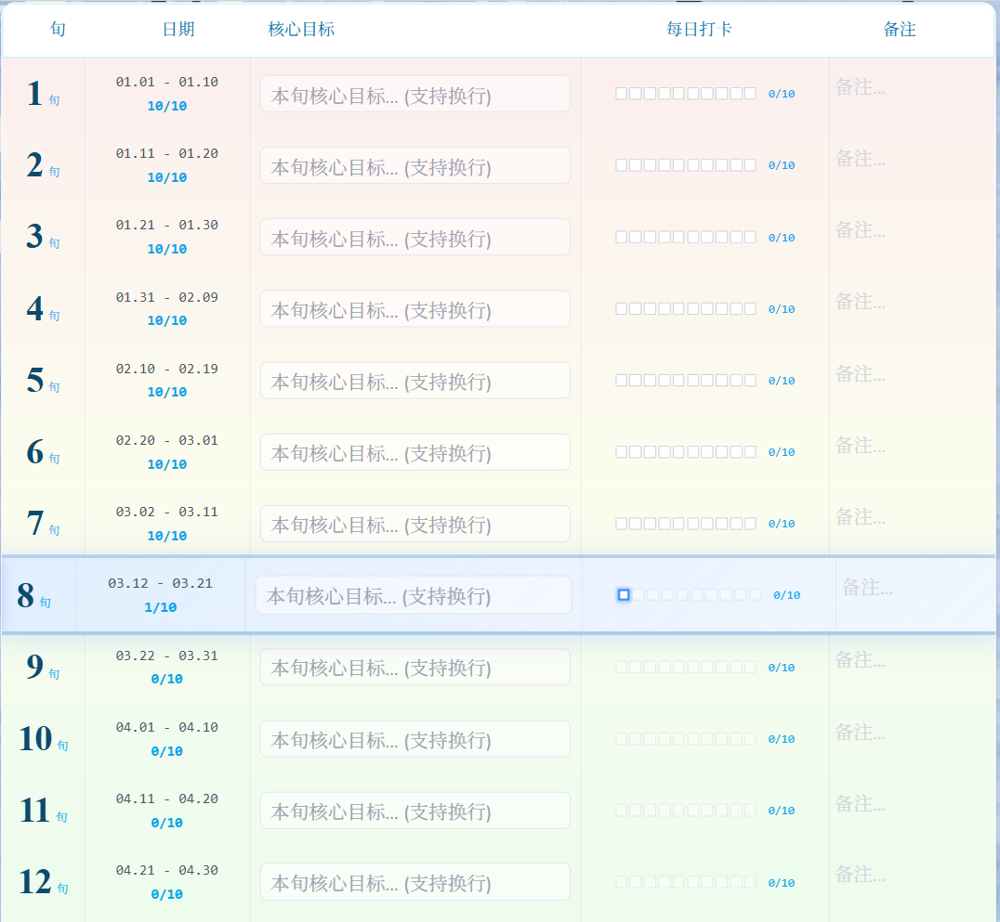
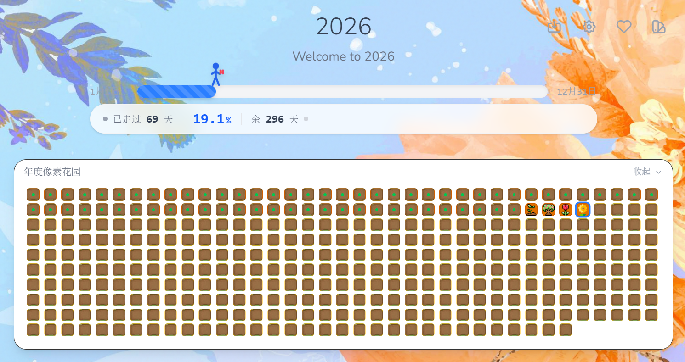

# 2026 · 旬 (36-Xun Perspective Calendar)

> 重新丈量时间的刻度，在三十六个“十天”里，找回生活的质感。

**版本：v1.2.0 | 更新日期：2026-03-08**

## 关于本项目

我们习惯了用“月”来标记进度，用“周”来安排工作。但在日复一日的忙碌与琐碎中，时间往往面目模糊，倏忽而逝。

**2026 · 旬** 是一次关于时间感知的尝试。我们将一年不再仅仅切分为12个月，而是重新划分为 **36 个“旬”**（每旬 10 天）。

“旬”，是古老的时间单位，也是一种恰到好处的生活节奏。十天，既不会像一天那样稍纵即逝，也不会像一月那样漫长得让人懈怠。在这里，我们希望帮你建立一种新的时间坐标系：**以“旬”为单位去规划宏愿，以“日”为单位去觉察身心。**

在这个快节奏的时代，愿你拥有一个安静的角落，记录当下，感知流变。

## ✨ 核心体验

### 🔭 宏观视角：三十六旬 (The 36 Xun)
*   **时间的切片**：将漫长的 2026 年拆解为 36 段旅程。不再被宏大的年度计划压垮，而是专注于眼前的这 10 天。
*   **旬目标**：为每个 10 天设定一个小而确定的期待。也可以是想要提醒自己保持觉察的状态，或者一些不同的主题探寻。
*   **时间进度可视化**：


### 🧘 微观感知：每日觉察 (Daily Mindfulness)
我们关注的不仅仅是"完成了什么"，更是"感觉如何"。
*   **情绪光谱**：用 5 种心情等级和细腻的自定义标签，记录每一天的内心起伏。
*   **生活切片**：
    *   😴 **睡眠**：双轴滑块记录睡眠时间，精确到15分钟，支持跨昼夜计算
    *   🏃 **运动**：身体活动了吗？
    *   📚 **阅读**：灵魂充能了吗？
    *   💰 **财富**：收支平衡吗？
    *   🤝 **社交**：与人连接了吗？
*   **三件好事**：每日记录三件值得感恩的事，本旬小结时智能分析和展示
*   **给明天的信**：在一天结束时，留下一句给未来的话，或是一次自我对话。


###  可视化：看见生活的形状
*   **年度足迹**：每一个像素格子都是你经过的一天。过去已去，未来未来，当下即是高亮。



*   **每日画卷**：当你回望时，你的情绪色彩、你的坚持轨迹，都将汇聚成一副独属于你的年度热力图。


### 💬 灵感：一期一会
*   **每日金句**：也许是一句诗，也许是一句台词，也许是一段歌词。每天打开时，希望能给你带来片刻的共鸣与抚慰。（支持书籍、影视、音乐、诗词等多源内容，手动刷新更新）

### ♥️ 生理周期追踪 (Menstrual Cycle Tracking)
专为女性用户设计的贴心功能，温柔记录身体的自然节律。
*   **周期记录**：直观的月历视图，轻松记录经期日期
*   **智能预测**：基于历史数据预测下次经期
*   **周期分析**：自动计算平均周期长度和经期天数
*   **隐私保护**：所有数据仅存储在本地，尊重个人隐私

## 💾 数据安全与备份 (Data & Backup)
鉴于数据纯本地存储的特性，我们提供了完善的数据韧性方案：
*   **手动备份**：随时将所有数据导出为 JSON 文件，文件名包含精确时间戳。
*   **数据恢复**：支持导入备份文件，系统会自动校验格式与版本，防止数据损坏。
*   **自动快照**：开启"自动备份"后，系统会在数据变更时自动在后台保存最近 7 份快照，以防误删。
*   **存储提醒**：⚠️ 数据仅存储在浏览器本地，清理浏览器或更换设备会导致数据丢失，请定期备份。

> 📋 **详细存储说明**：查看 `DATA_STORAGE_REMINDER.md` 了解完整的数据存储指南和注意事项。

## 📱 移动端适配 (Mobile First)
本项目采用移动优先的响应式设计，确保在各种设备上均有最佳体验：
*   **手机端**：底部导航栏方便单手操作，触控区域优化（≥48px），大号字体防误触。
*   **桌面端**：沉浸式宽屏布局，顶部导航，鼠标交互优化。
*   **兼容性**：支持主流现代浏览器，并为 IE11 等旧版浏览器提供基础降级支持。

## 🛠️ 技术实现

这是一个纯粹的、注重隐私的 Web 应用。

### 技术栈
- **核心架构**：原生 HTML5 + JavaScript (ES Modules)，轻量级，无框架依赖
- **样式设计**：[Tailwind CSS 4.1.18](https://tailwindcss.com/) 打造的极简主义界面，支持多主题切换
- **构建工具**：[Vite 8.0.5](https://vitejs.dev/) 提供快速开发和构建
- **数据存储**：所有数据均存储在您浏览器的 `localStorage` 中。**没有服务器，没有账号，没有上传。** 你的生活记录只属于你自己
- **外部依赖**：
  - [Chart.js 4.5.1](https://www.chartjs.org/) (绘制直观的数据图表)
  - [lunar-javascript 1.7.7](https://github.com/6tail/lunar-javascript) (提供精准的农历与节气支持)
- **测试覆盖**：使用 Jest 30.2.0 进行单元测试，Playwright 1.58.1 进行E2E测试，核心模块覆盖率 >80%

### 项目结构
```
src/
├── components/          # 视图组件
│   ├── Modal.js         # 每日记录弹窗 (68KB, 1533行) - 整合睡眠、身体状态、金钱觉察
│   ├── DetailView.js    # 旬详情视图 (20KB)
│   ├── SummaryView.js   # 旬总结视图 (38KB) - 整合XunSummary和MoneyObservationSummary
│   ├── MacroView.js     # 36旬宏观视图 (10KB)
│   ├── OverviewView.js  # 年度概览 (10KB)
│   ├── MoneyAwarenessModule.js    # 金钱觉察模块 (41KB)
│   ├── MoneyObservationSummary.js # 金钱观察总结 (52KB)
│   ├── MenstrualView.js  # 生理周期追踪 (28KB)
│   ├── BackupModal.js    # 数据备份弹窗 (10KB)
│   ├── SettingsModal.js  # 设置弹窗 (10KB)
│   ├── sleep/            # 睡眠模块子组件 (CircularSleepSelector, ClockRenderer等)
│   ├── MacroView/        # 宏观视图子组件 (DesignSystem, ProgressRenderer等)
│   └── web-components/   # Web Components (LifeCard, XunRow)
├── core/                # 核心模块
│   ├── State.js         # 状态管理 (15KB) - Store pattern with localStorage persistence
│   ├── Calendar.js      # 日期计算 (15KB) - 旬周期计算、日期处理、时区安全
│   ├── app.js           # 主应用 (25KB) - 视图路由、事件协调
│   ├── XunSummary.js    # 旬数据统计 (23KB) - 数据聚合、洞察生成
│   ├── BackupManager.js # 备份管理 (6KB)
│   ├── BackgroundLoader.js # 背景加载 (7KB)
│   ├── ThemeManager.js  # 主题管理 (2KB)
│   ├── YearProgress.js  # 年度进度 (6KB)
│   ├── NavigationManager.js # 导航管理 (2KB)
│   └── PixelFarm.js     # 像素花园 (8KB)
├── config.js            # 配置文件 (4KB) - 数据模型、存储键、默认值
├── quote.js             # 每日金句系统 (5KB)
├── styles/              # 样式文件
│   ├── design-tokens.css    # 设计令牌 (5KB)
│   ├── body-state.css       # 身体状态样式 (11KB)
│   └── responsive-backgrounds.css # 响应式背景 (4KB)
├── input.css            # Tailwind入口 (3KB)
├── output.css           # 编译后的CSS (135KB)
└── images/              # 静态资源
```

### 核心架构说明

**状态管理 (State.js)**
- 采用 Store pattern，统一管理所有应用状态
- 支持订阅机制，状态变更自动通知订阅者
- 持久化到 localStorage，支持自动备份
- 管理的数据包括：用户记录、宏观目标、自定义情绪/滋养、生理周期、设置等

**日期计算 (Calendar.js)**
- 提供36旬周期计算（从年初开始的连续10天周期）
- 时区安全的日期处理（parseDateStrToLocalDate, startOfDay）
- 支持动态年份（2026-2100）
- 提供日期范围查询、旬定位等工具函数

**主应用 (app.js)**
- 视图路由管理（macro, overview, detail, summary）
- 协调各视图组件的渲染
- 处理弹窗、备份、设置等交互
- 移动端FAB、滚动高亮等UI增强

**旬数据统计 (XunSummary.js)**
- 聚合旬内所有记录数据
- 计算睡眠、精力、运动、阅读等指标
- 生成洞察和建议
- 支持三件好事统计分析

### 数据流
```
用户交互 → Modal/DetailView → State.setState() → localStorage持久化 → 订阅者通知 → 视图重渲染
```

### 已知技术债务
- **P0（关键逻辑）**：Double save logic、getXunRange()与getXunPeriods()定义矛盾、cloneNode DOM替换
- **P1（架构设计）**：Breakpoint系统冲突、内联CSS硬编码、app.js和Modal.js文件过大需要拆分
- **P2（性能质量）**：initPixelFarm()全量重建、无prefers-reduced-motion保护、CDN依赖未通过Vite打包
- **P3（优化建议）**：Service Worker未启用、Modal缺乏focus trap、辅助功能改进

详见项目文档中的Bug Registry和QA Rules。

## 🚀 使用指南

### 🌐 在线体验 (推荐)
**GitHub Pages 链接**: [https://magiccoai.github.io/36-xun-calendar/](https://magiccoai.github.io/36-xun-calendar/)

#### 浏览器兼容性
- **推荐浏览器**: Chrome 80+, Firefox 75+, Safari 13+, Edge 80+
- **移动端**: iOS Safari 13+, Android Chrome 80+
- **不支持**: IE11 (仅基础功能)

#### 多设备使用说明
- **数据存储**: 所有数据仅存储在当前浏览器的本地存储中
- **跨设备同步**: 目前不支持自动同步
- **解决方案**: 
  1. 使用数据备份功能定期导出数据
  2. 在新设备上导入备份文件
  3. 建议主要在一个设备上使用，避免数据分散

#### 手机 vs 桌面端差异
- **手机端**: 底部导航，单手优化，触控友好
- **桌面端**: 顶部导航，宽屏布局，键盘快捷键支持
- **数据完全独立**: 手机和桌面打开同一链接是独立的数据空间

### 💻 本地安装使用

#### 方法一：安装为离线应用 (PWA - 推荐，最便捷)
**无需下载代码，像原生 App 一样使用**

1.  **访问在线地址**：在 Chrome、Edge 或 Safari 浏览器中打开 [https://magiccoai.github.io/36-xun-calendar/](https://magiccoai.github.io/36-xun-calendar/)。
2.  **安装到设备**：
    *   **电脑端**：点击地址栏右侧出现的“安装”图标（或在菜单中选择“安装 36旬日历”）。
    *   **手机端**：点击浏览器的“分享”按钮，选择“添加到主屏幕”。
3.  **离线运行**：安装后，桌面或手机屏幕会出现应用图标。即便在断网状态下，您也可以直接点击图标进入日历，体验与原生 App 无异。

**优势**：
- ✅ **零安装**：无需下载任何压缩包或安装环境。
- ✅ **离线优先**：即使没有网络，所有功能也能完美运行。
- ✅ **绝对隐私**：数据完全存储在您本地设备的浏览器中，绝不上传云端。

#### 方法二：开发者本地运行
如果您需要修改代码或进行二次开发：
- ✅ 隐私安全，所有数据仅保存在您的设备上
- ✅ 跨平台支持（Windows、macOS、Linux）

#### 方法二：克隆源码（适合开发者）
```bash
# 1. 克隆项目
git clone https://github.com/magiccoAI/36-xun-calendar.git

# 2. 进入项目目录
cd "36-xun-calendar"

# 3. 安装依赖
npm install

# 4. 构建项目
npm run build

# 5. 进入 dist 目录，双击 index.html 使用
cd dist
# 或使用本地服务器预览
npm run preview
```

#### 方法三：开发模式（仅用于开发调试）
```bash
# 1. 克隆并安装依赖
git clone https://github.com/magiccoAI/36-xun-calendar.git
cd "36-xun-calendar"
npm install

# 2. 启动开发服务器
npm run dev

# 3. 浏览器自动打开 http://localhost:3000
```

## 🆕 v1.2.0 新功能亮点

### 🎨 睡眠记录升级
- **双轴滑块**：直观的入睡和起床时间选择器

### 🛡️ 数据保护强化
- **存储提醒文档**：详细的数据丢失风险说明和保护策略
- **备份最佳实践**：跨设备使用和长期存储指导
- **自动备份优化**：更可靠的后台快照机制

### 🧪 技术改进
- **测试覆盖**：核心模块单元测试覆盖率 >80%
- **ES Modules**：现代化模块系统，更好的代码组织
- **多主题支持**：季节性主题切换（春、夏、秋、冬）
- **响应式优化**：更完善的移动端体验

## 📄 许可证

本项目源码公开，仅供个人学习与研究使用。未经许可，严禁用于任何形式的商业用途。


---

*2026，愿你在每一个"旬"里，都能找到属于自己的节奏。*
